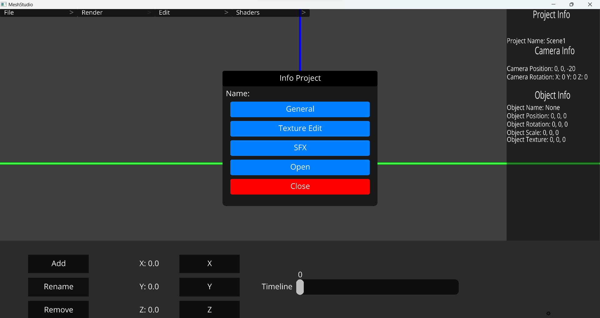

  
   
  
   
  
  
  
  
  </a>

# MeshStudio
MeshStudio is a 3d software, texture editor and sound creator.

MeshStudio is a software created entirely with the Python and with Ursina Engine library.

This software has several external features and plugins created by the community

## Features

<h2>Modilisation</h2>

<h2>Lights</h2>

**Keybinds**:

  **shift + a**: Add an object

  **shift + r**: Rotate object
  
  **shift + t**: Modify the texture path
  
  **shift + s**: Save project
  
  **shift + o**: Open project

  **left arrow / right arrow**: rotate object in the Y axis

  **up arrow / down arrow**: rotate object in the X axis

  **ctrl + scroll up**: + size to texture brush
  
  **ctrl + scroll down**: - size to texture brush

## Updates

### Patch 1.1.0

**New features**:
   1. Rotate cube with new **gismoz**
   2. New **gismoz** for the **position** and for the **rotation**
   3. New **timeline system** with Panel

**Patch**:
   1. **Crash** when you try to **import object**

### Patch 1.0.0

**New features**:
   1. Rotate cube with the **arrows**
   2. Export model **OBJ** and **GLTF**
   3. Show **vertices** of cubes 

**Patch**:
   1. Fixed **multiple panel** open

## Examples

*Version BETA-1.4.0.0*
