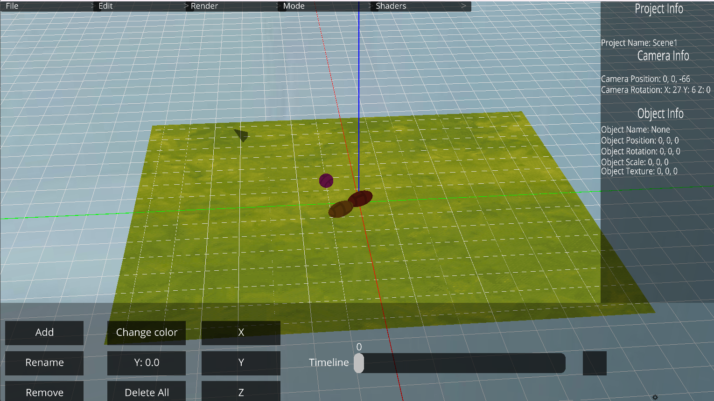

<p align="center">
  
  <br>
  
  <br>
  
  
  
  
  </a>
</p>

# MeshStudio
MeshStudio is a 3d software, texture editor and sound creator.

MeshStudio is a software created entirely with the Python and with Ursina Engine library.

This software has several external features and plugins created by the community

### **WARNING!** 

**YOU NEED INSTALL ```pip install https://github.com/Creator754915/Ursina.More.UI.git```**

# Features

<h2>General UI</h2>


<h2>Lights</h2>


<h2>Physics</h2>



<h2>Modelisation</h2>


<h2>Timeline</h2>


**Animation Example:**

```json
{
   "frame": {
      "0": {
         "model": {
            "name": "HELLO",
            "position": [
               0.0,
               0.0,
               0.0
            ],
            "scale": [
               1.0,
               1.0,
               1.0
            ],
            "color": "Color(1.0, 1.0, 1.0, 1.0)"
         }
      },
      "36": {
         "model": {
            "name": "HELLO",
            "position": [
               -3.188293933868408,
               0.08317279070615768,
               2.682209014892578e-07
            ],
            "scale": [
               1.0,
               1.0,
               1.0
            ],
            "color": "Color(1.0, 1.0, 1.0, 1.0)"
         }
      }
   }
}
```

<br>

<h2>Texture Editor</h2>


<p>Coming soon...</p>

<br>

# GeometryNodeEditor


```
ColorNode(
    color = (255, 255, 255)
    size = (1, 1, 1)
    position = (0.5, 0, 0)
)
    
ModelNode(
    model="cube",
    scale=5
    position=(0, 0, 0)
)

CameraNode(
    camera=1,
    position=(-0.5, 0, 0)
)


INIT:
    ColorNode()
    ModelNode()
    CameraNode()
```

**Save model for GeometryNodeEditor**


## Keybinds:

  **shift + a**: Add an object

  **shift + r**: Rotate object
  
  **shift + t**: Modify the texture path
  
  **shift + s**: Save project
  
  **shift + o**: Open project

  **ctrl + right click**: Open Panel

  **left arrow / right arrow**: rotate object in the Y axis

  **up arrow / down arrow**: rotate object in the X axis

  **ctrl + scroll up**: + size to texture brush
  
  **ctrl + scroll down**: - size to texture brush

## Updates

### Patch 2.0.0
**New features**:
  1. RigidBody add

### Patch 1.1.0

**New features**:
   1. Rotate cube with new **gizmos**
   2. New **gizmos** for the **position** and for the **rotation**
   3. New **timeline system** with Panel

**Patch**:
   1. **Crash** when you try to **import object**


### Patch 1.0.0

**New features**:
   1. Rotate cube with the **arrows**
   2. Export model **OBJ** and **GLTF**
   3. Show **vertices** of cubes 

**Patch**:
   1. Fixed **multiple panel** open

## Examples

## The All Contributors Table

<table>
  <tbody>
    <tr>
      <td align="center" valign="top" width="14.28%"><a><br /><sub><b>IndividualCoder</b></sub></a><br /><a href="https://github.com/IndividualCoder" title="Developper">💻</a> <a href="#talk-kentcdodds" title="Talks">📢</a></td>
    </tr>
  </tbody>
</table>


*Version BETA-1.5.0*
